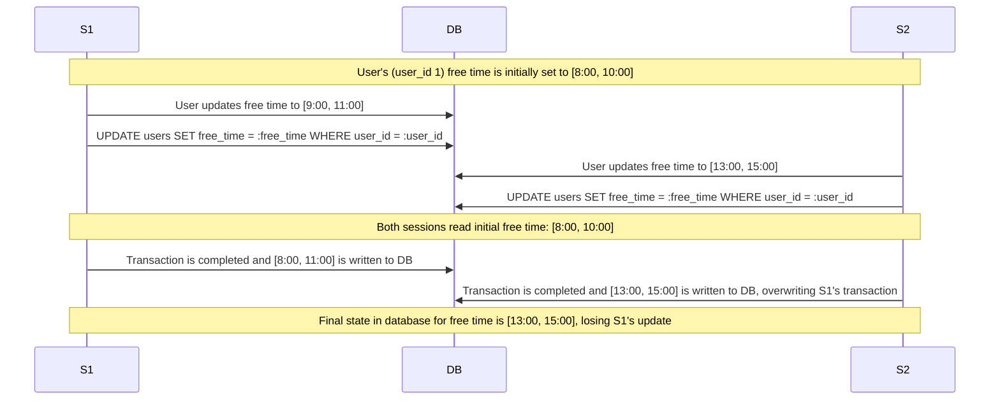
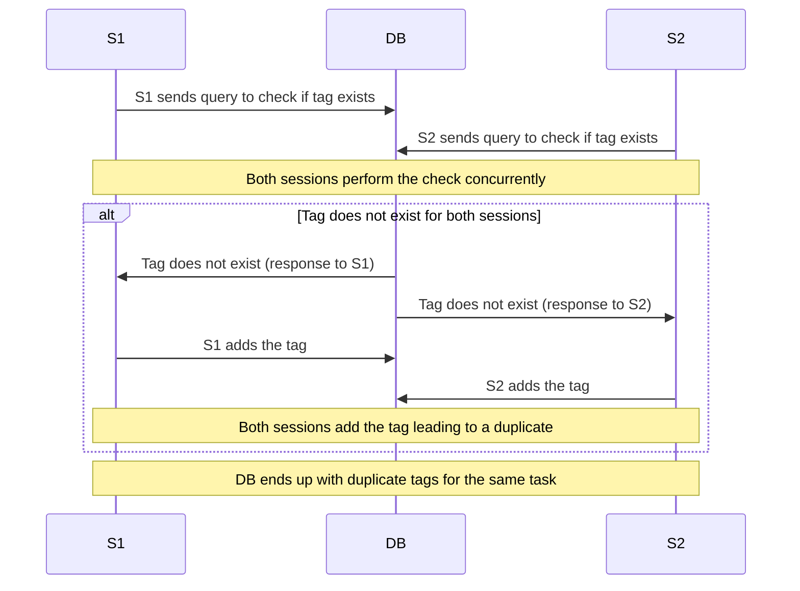
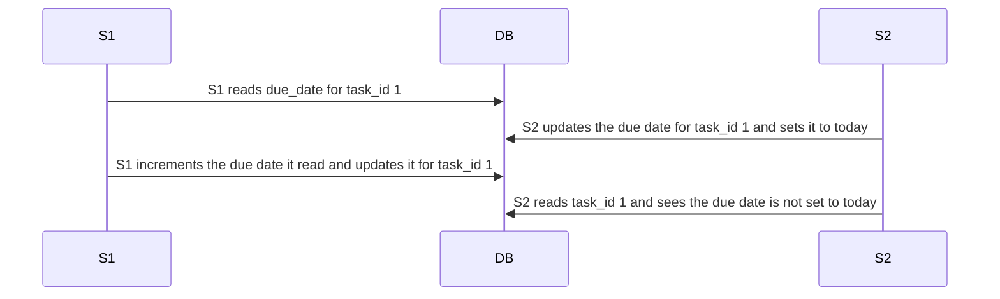

# Case 1: Concurrent User Availability Updates (Lost Updates)
**Scenario:** A user updates their free time/availability using `/scheduler/set_free_time/{user_id}` in two different sessions at the same time.

**Solution:** Use pessimistic locking, specifically explicit locking via `FOR UPDATE`, to prevent other sessions from updating free time while the current session is in the middle of updating the `users` table. This approach is appropriate since explicit locking is usually used to ensure exclusive access to records to prevent conflicting updates from other transactions, which is this exact issue.

# Case 2: Concurrent Tag Addition (Race Condition Causing Duplicate Insertion)
**Scenario:** A user updates tags to a task using `/tags/add` in two different sessions at the same time.

**Solution:** A `FOR_UPDATE` could again be used in this example in order to prevent other sessions from updating the tags table, causing the race condition described above.

# Case 3: Concurrent Task Update (Lost Update)
**Scenario:** User reads a due_date from a task and increments the due_date by 1 day, at the same time as another user is updating the due date.

**Solution:** Avoid using multiple transactions for updating tasks based on existing values. In this example, the initial read by S1 can be executed in the update query by incrementing the due_date in the SQL statement.