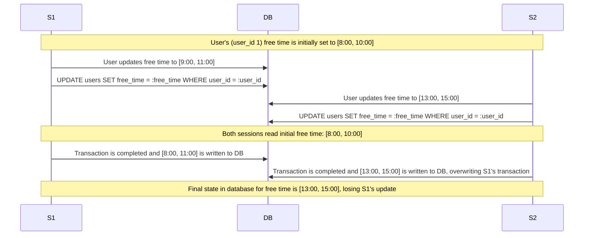

# Case 1: Concurrent User Availability Updates (Lost Updates)
**Scenario:** A user updates their free time/availability using `/scheduler/set_free_time/{user_id}` in two different sessions at the same time.

**Solution:** Use pessimistic locking, specifically explicit locking via `FOR UPDATE`, to prevent other sessions from updating free time while the current session is in the middle of updating the `users` table. This approach is appropriate since explicit locking is usually used to ensure exclusive access to records to prevent conflicting updates from other transactions, which is this exact issue.
# Case 2

# Case 3
